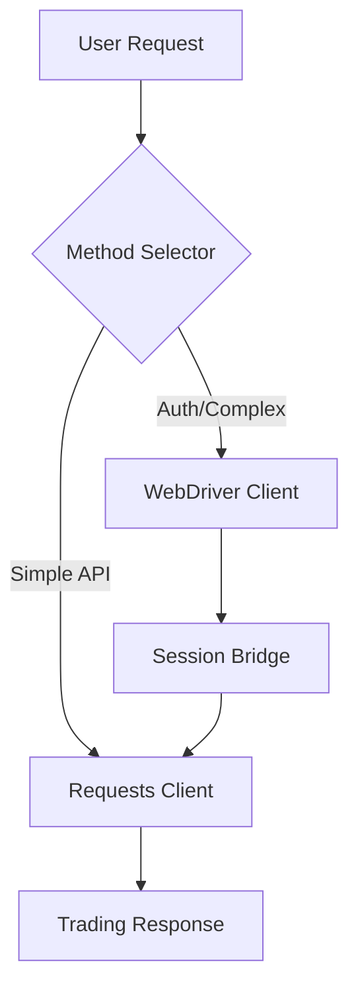

# Plus500US Python SDK

[](https://www.python.org/downloads/)
[](https://opensource.org/licenses/MIT)
[](https://github.com/ENHarry/plus500US_api/actions)

**Unofficial Python SDK for Plus500US futures trading automation with hybrid WebDriver/requests architecture.**

> ⚠️ **Disclaimer**: This is an unofficial SDK for educational and demo purposes. Always respect Plus500US Terms of Service and use responsibly.

## 🚀 Features

- **🤖 Hybrid Architecture**: Intelligent switching between requests and WebDriver automation
- **🔐 Robust Authentication**: WebDriver-based login with session handoff to requests
- **📊 Complete Trading API**: Market/limit orders, positions, risk management
- **🛡️ Safety First**: Built-in validation, partial take profit protection, risk controls
- **🔄 Auto-Fallback**: Seamless switching when anti-bot detection is encountered
- **⚡ High Performance**: Requests-first approach with WebDriver only when needed

## 📦 Installation

```bash
# Clone and install in development mode
git clone https://github.com/ENHarry/plus500US_api.git
cd plus500US_api
pip install -e .[dev]

# Set up environment variables
cp .env.example .env
# Edit .env with your Plus500US credentials
```

## 🎯 Quick Start

```python
from plus500us_client import Plus500ApiClient, load_config
from decimal import Decimal

# Initialize client
config = load_config()
client = Plus500ApiClient(config)

# Authenticate (hybrid method)
client.authenticate()

# Place a market order with risk management
order = client.place_market_order(
    instrument="GC",  # Gold futures
    side="BUY",
    quantity=Decimal("1"),
    stop_loss=Decimal("2650.00"),
    take_profit=Decimal("2750.00")
)

print(f"Order placed: {order['id']}")
```

**[📚 Full Documentation](docs/README.md)** | **[🎮 Quick Start Guide](docs/guides/quickstart.md)** | **[💡 Examples](examples/README.md)**

## WebDriver Automation Features

### 🤖 Primary Automation Method
WebDriver is now the **primary automation method** due to Plus500's advanced anti-bot protection. The system automatically handles:

- **Anti-Detection**: Stealth mode with undetected browser automation
- **Element Detection**: Robust XPath/CSS selectors with multiple fallbacks
- **Human-like Behavior**: Natural timing patterns and mouse movements
- **Session Management**: Automatic cookie transfer between WebDriver and requests

### 🛡️ Critical Safety Features

**Partial Take Profit Validation** - Prevents position corruption:
```python
# ✅ SAFE: Position has 5 contracts, closing 2, leaving 3
execute_partial_take_profit("POS_001", Decimal("2"))

# ❌ BLOCKED: Position has only 1 contract
execute_partial_take_profit("POS_002", Decimal("0.5"))  # ValidationError

# ❌ BLOCKED: Would leave 0.5 contracts remaining  
execute_partial_take_profit("POS_001", Decimal("4.5"))  # ValidationError
```

### 🔄 Intelligent Fallback System

The hybrid system automatically switches methods based on conditions:
- **Captcha Detection** → Switch to WebDriver
- **Rate Limiting** → Circuit breaker protection
- **Anti-Bot Blocks** → Automatic method selection
- **Context Awareness** → Adapts to different scenarios

### 📊 Complete Trading Operations

```python
from plus500us_client.webdriver import WebDriverTradingClient
from decimal import Decimal

# Market order with risk management
client.place_market_order(
    "EURUSD", "BUY", Decimal("1"),
    stop_loss=Decimal("1.0950"),
    take_profit=Decimal("1.1050")
)

# Limit order
client.place_limit_order(
    "GBPUSD", "SELL", Decimal("2"), 
    limit_price=Decimal("1.2600")
)

# Position monitoring
positions = client.get_positions()
for pos in positions:
    pnl = client.monitor_position_pnl(pos['id'])
    print(f"Position P&L: ${pnl}")
```

## 📚 Examples

Comprehensive examples are available in the `examples/` directory:

- **`webdriver_login.py`** - WebDriver authentication basics
- **`webdriver_trading.py`** - Trading operations and risk management
- **`hybrid_fallback.py`** - Intelligent fallback system demo
- **`complete_workflow.py`** - End-to-end automation workflow

See [`examples/README.md`](examples/README.md) for detailed documentation.

## 🏗️ Architecture Overview

The Plus500US SDK uses a **requests-first architecture** with intelligent WebDriver fallback:



### Core Components

- **[`plus500us_client/requests/`](plus500us_client/requests/)** - HTTP API client (primary method)
- **[`plus500us_client/webdriver/`](plus500us_client/webdriver/)** - Browser automation (authentication & fallback)  
- **[`plus500us_client/hybrid/`](plus500us_client/hybrid/)** - Intelligent method selection & session bridge

## 📋 Requirements

- **Python 3.8+** (3.11+ recommended)
- **Firefox Browser** (for WebDriver automation)
- **Plus500US Account** (demo or live)
- **Environment Variables** (credentials and configuration)

## ⚙️ Configuration

Create a `.env` file:

```bash
# Plus500US Account
PLUS500_EMAIL=your.email@example.com
PLUS500_PASSWORD=your_secure_password
PLUS500_ACCOUNT_TYPE=demo  # or 'live'

# WebDriver Settings
WEBDRIVER_HEADLESS=false
WEBDRIVER_TIMEOUT=30

# Risk Management
MAX_POSITION_SIZE=10
MAX_DAILY_LOSS=1000
```

## 🧪 Testing

Run the comprehensive test suite:

```bash
# All tests
pytest tests/ -v

# WebDriver tests only
pytest tests/ -m webdriver -v

# Skip WebDriver tests (requests only)
pytest tests/ -m "not webdriver" -v

# Complete workflow test
pytest tests/test_complete_workflow.py -v -s
```

## 🚀 Development

### Setting Up Development Environment

```bash
# Clone repository
git clone https://github.com/ENHarry/plus500US_api.git
cd plus500US_api

# Create virtual environment
python -m venv venv
source venv/bin/activate  # Linux/macOS
# or
venv\Scripts\activate     # Windows

# Install in development mode
pip install -e .[dev]

# Install pre-commit hooks
pre-commit install
```

### Running Examples

```bash
# Basic authentication
python examples/webdriver_login.py

# Complete trading workflow
python examples/complete_workflow.py

# Interactive login (manual)
python examples/interactive_login.py
```

## 📖 Documentation

- **[📚 Complete Documentation](docs/README.md)**
- **[🎮 Quick Start Guide](docs/guides/quickstart.md)**
- **[🔧 Installation Guide](docs/guides/installation.md)**
- **[🔐 Authentication Guide](docs/guides/authentication.md)**
- **[📊 Trading Guide](docs/guides/trading.md)**
- **[🤖 WebDriver Guide](docs/guides/webdriver.md)**
- **[📝 API Reference](docs/api/)**

## 🤝 Contributing

Contributions are welcome! Please read our [Contributing Guide](CONTRIBUTING.md) for details on:

- Code style and standards
- Testing requirements
- Pull request process
- Development workflow

## 📄 License

This project is licensed under the MIT License - see the [LICENSE](LICENSE) file for details.

## ⚠️ Disclaimer

This is an **unofficial** SDK created for educational and demonstration purposes. It is not affiliated with, endorsed by, or connected to Plus500US in any way.

**Important:**
- Always respect Plus500US Terms of Service
- Test thoroughly with demo accounts before live trading
- This software is provided "as-is" without warranty
- Use at your own risk - trading involves substantial risk of loss

## 🔗 Links

- **[GitHub Repository](https://github.com/ENHarry/plus500US_api)**
- **[Documentation](docs/README.md)**
- **[Examples](examples/README.md)**
- **[Issue Tracker](https://github.com/ENHarry/plus500US_api/issues)**
- **[Plus500US Website](https://futures.plus500.com/)**

## 🙏 Acknowledgments

- Plus500US for providing the trading platform
- Selenium WebDriver community for automation tools
- Python community for excellent libraries and tools

---

**Built with ❤️ for algorithmic traders and automation enthusiasts**
